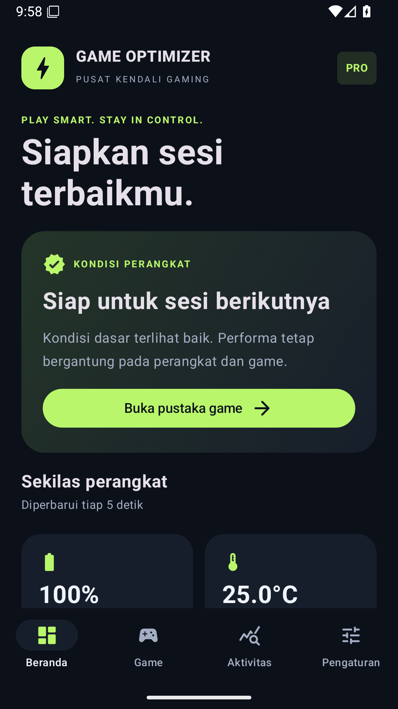
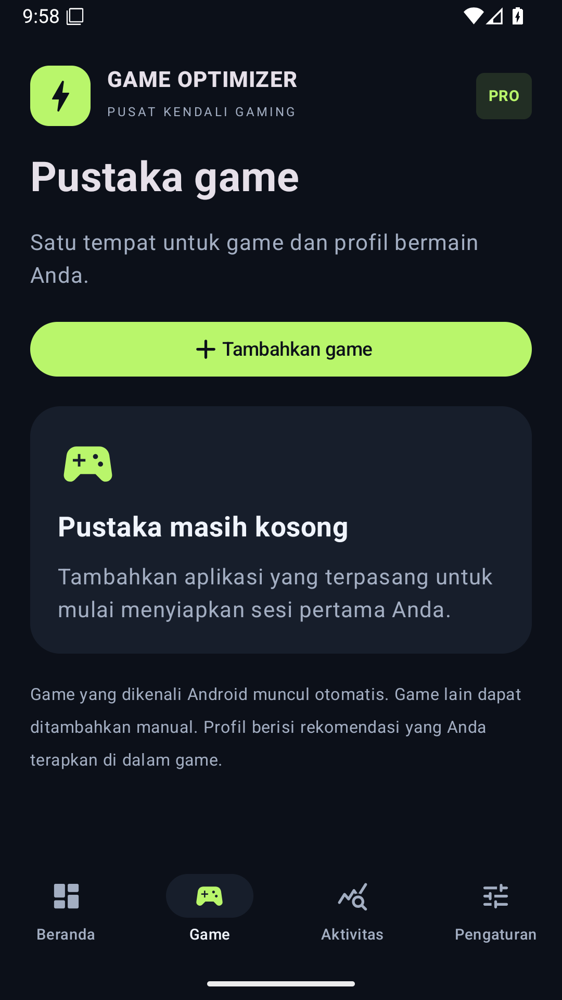
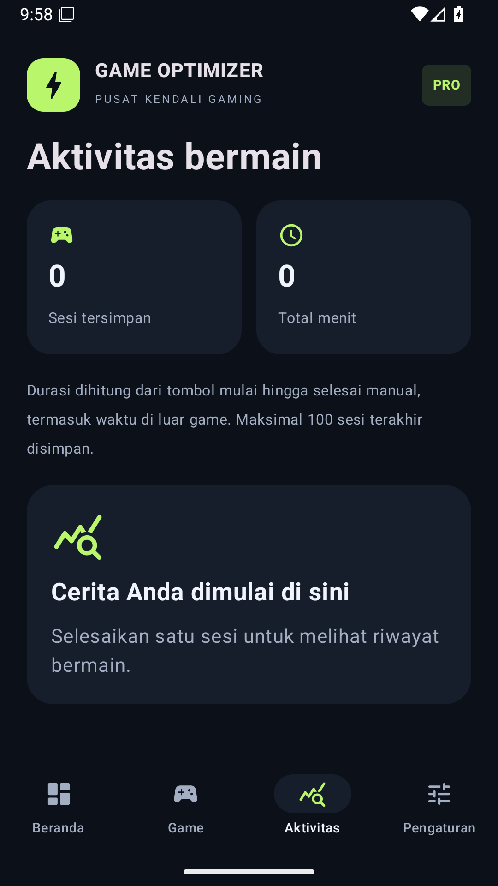

# Game Optimizer PRO

Native Android gaming companion built with Kotlin and Jetpack Compose. Indonesian interface, dark premium theme, lime accents, Android 8+ support.

**Application ID:** `com.deploydulupulangnanti.gameoptimizerpro`  
**Version:** 1.0.0 (1) · **Target SDK:** 36 · **Minimum SDK:** 26

## Screenshots

Actual Android 16 emulator captures; device readings are emulator values.

  

## Features

- Live device dashboard: available system RAM, battery level/temperature, free storage, connectivity, power saving and thermal warnings.
- Game library: Android-classified games plus user-selected launcher apps; search and launch.
- Per-game Balanced, Competitive, and Endurance recommendation profiles.
- Persistent manual session timer and up to 100 completed sessions, with deletion controls.
- Shortcuts to Wi-Fi, Do Not Disturb, display, and battery settings.
- Offline-first: no account, ads, analytics, server, or Internet permission.

Android does not allow ordinary apps to force another game's frame rate, overclock hardware, or free other apps' RAM reliably. This app offers real device data and preparation tools, not synthetic boosts. Profiles are guidance and do not modify games. Battery temperature is not CPU/GPU temperature. Session time includes all elapsed time until manually ended.

## Build

Open this folder in Android Studio with Android SDK 36 installed. Use JDK 17 or 21. The committed Gradle wrapper downloads Gradle 8.13 with a SHA-256 check.

```powershell
$env:JAVA_HOME = 'C:\Program Files\Android\Android Studio\jbr'
.\gradlew.bat testDebugUnitTest lintDebug assembleDebug
.\gradlew.bat bundleRelease assembleRelease
```

Set your SDK path in ignored `local.properties`. Release signing uses environment variables or ignored `keystore.properties`:

```properties
KEYSTORE_PATH=D:/KEYSTORE/game_optimizer_pro.jks
KEYSTORE_PASSWORD=<private>
KEY_ALIAS=game_optimizer_pro
KEY_PASSWORD=<private>
```

Keep a secure offline backup of the key and credentials. They are not committed. Without signing inputs, local release output is unsigned; the GitHub release job explicitly requires all four secrets.

## GitHub Actions

The `Android build` workflow uses ephemeral GitHub-hosted `ubuntu-latest` runners. Pull requests run JVM tests, Android lint and debug APK builds. Pushes to `main`, `v*` tags, and manual dispatches additionally produce a signed APK and Play Store AAB after verification passes.

Android 36 emulator tests exercise navigation, privacy, persistence, and session lifecycle, and capture actual UI screenshots. Release output requires both verification jobs to pass.

Repository Actions secrets: `KEYSTORE_BASE64`, `KEYSTORE_PASSWORD`, `KEY_ALIAS`, `KEY_PASSWORD`. Download outputs from the workflow run's Artifacts section. The runner's temporary key is removed even if the build fails. No Play Console deployment occurs automatically.

## Release preparation

See [Play Store checklist](docs/PLAY_STORE.md), [privacy policy](docs/PRIVACY_POLICY.md), and [QA checklist](docs/QA.md). Source code is proprietary; no third-party redistribution license is granted. Dependency licenses remain applicable.
